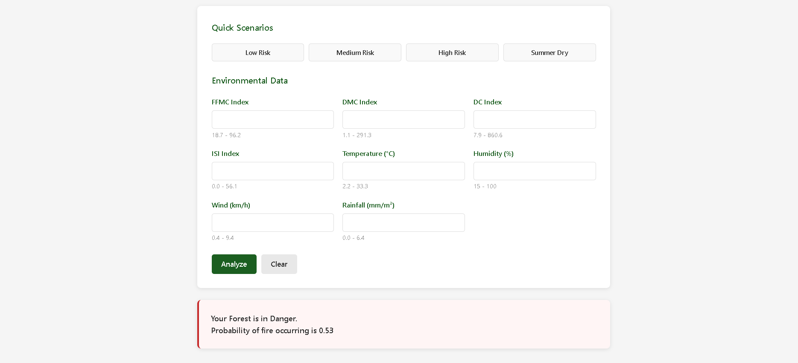
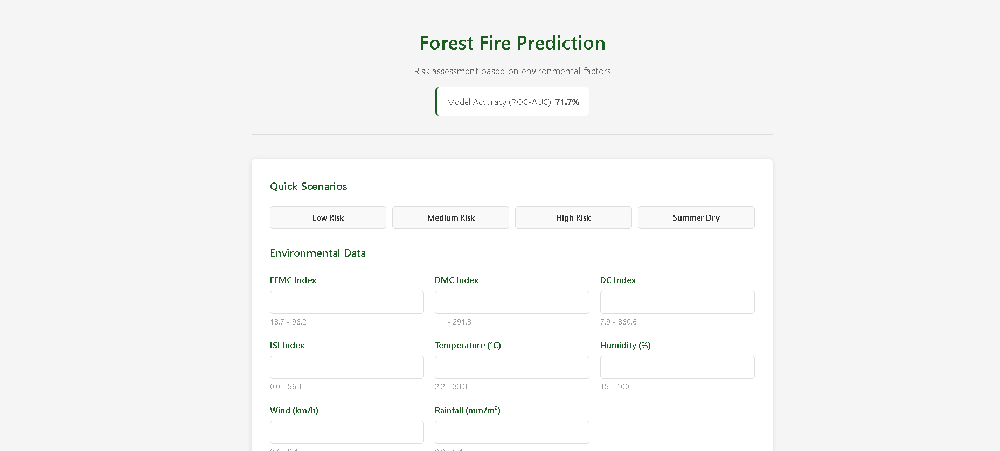

Read comments in the app.py[app.py] and also in readme[readme_temp.md]

Forest Fire Prediction is a Flask application that serves a trained machine learning model to estimate the probability of a fire given eight environmental factors from the FWI system. The repository contains a reproducible training script, the saved model artifact, the web UI, and supporting assets. 

The data source is the UCI Forest Fires dataset (forestfires.csv) with 517 rows. The binary target is defined as fire if area > 0, and the feature set includes FFMC, DMC, DC, ISI, temperature, relative humidity, wind speed, and rainfall. Data is split with stratification on the target to preserve class balance. 

The training pipeline in main.py builds a StandardScaler plus RandomForestClassifier (300 estimators, balanced_subsample class weights, min_samples_leaf=2, random_state=42). Evaluation uses ROC-AUC, confusion matrix, and classification report. Metrics and plots are written to outputs/, and the fitted pipeline is persisted to forestfiremodel.pkl for serving. The Matplotlib backend is set to Agg for headless rendering when saving figures. 

To reproduce training locally, install requirements, then run python main.py from the project root; this writes forestfiremodel.pkl and artifacts into outputs/. To serve predictions, run python app.py and open the root route to access the minimal web form; form submissions call the model’s predict_proba on the ordered feature vector and render the probability with a safety/danger message. The UI supports quick-fill scenarios for low, medium, high, and summer-dry conditions and displays the last recorded ROC-AUC when metrics.json is present. 

The repository layout is straightforward: app.py is the Flask server, main.py is the training script, forestfires.csv is the dataset, forestfiremodel.pkl is the trained model, templates/index.html is the front end, static/ holds CSS/JS assets, outputs/ stores plots and metrics, and Notebooks/ retains exploratory notebooks. The GIF screenrecording.gif demonstrates the earlier interface. 

Future work can improve model discrimination by experimenting with class imbalance handling, calibrated probabilities, cross-validation over hyperparameters, and additional feature engineering on temporal or spatial signals. Continuous evaluation and retraining with fresh data would further harden the deployed model. 

#### Demo:

